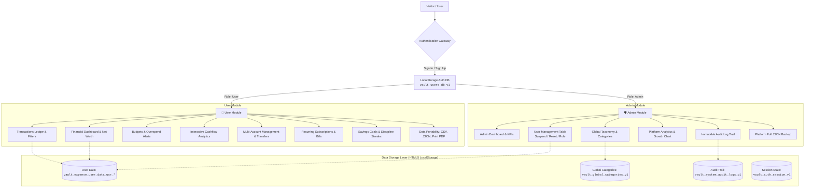

# 🛡️ VaultExpense — Financial OS & Expense Tracker (SDC Project)

> **Skill Development Course (SDC) Comprehensive Project**  
> A state-of-the-art Personal and Small Business Expense Management System engineered strictly using **Pure Vanilla HTML5, CSS3 (Grid & Flexbox), and JavaScript (ES6+)** with zero external frontend/backend frameworks.

---

## 📌 1. Problem Statement & Business System

### 1.1 Problem Statement
Individuals, freelancers, and small business owners frequently encounter difficulties monitoring their financial health due to:
1. **Financial Opacity**: Lack of unified, real-time visibility into balances distributed across multiple checking, savings, credit card, and cash accounts.
2. **Unchecked Overspending**: Absence of proactive budget threshold alerts before spending limits are breached.
3. **Forgotten Recurring Overhead**: Hidden subscription creep and missed due dates leading to late fees or unwanted renewals.
4. **Poor Financial Discipline**: Difficulty tracking long-term savings targets without visual milestones or discipline feedback loops.

### 1.2 Business System Solution
**VaultExpense** delivers a client-side Financial Operating System featuring **Role-Based Access Control (RBAC)** across two primary modules:
- **🛡️ Admin Module**: Centralized governance for managing users (view, suspend, promote, reset credentials), configuring global transaction categories and taxonomies, monitoring macro platform liquidity & growth charts, inspecting timestamped security audit logs, and managing platform JSON backups.
- **👤 User Module**: Personal financial cockpit featuring real-time Net Worth tracking, multi-account portfolio management, double-entry transfer wizard, monthly categorized budgets with dynamic alert indicators, recurring bills automation, gamified savings targets, AI receipt scanning simulation, multi-currency conversion, and multi-format data export (CSV, JSON, Formatted Print/PDF).

---

## 🏗️ 2. System Architecture & Module Flow



---

## 🔑 3. Pre-Seeded Demo Credentials

For demonstration and grading evaluation, the platform comes pre-seeded with two accounts:

| Role | Email | Password | Access & Capabilities |
| :--- | :--- | :--- | :--- |
| **🛡️ Administrator** | `admin@vault.io` | `Admin@123` | Full Admin Portal, User Management, Global Categories, Platform Analytics & Audit Trail |
| **👤 Demo User** | `demo@vault.io` | `Demo@123` | Pre-populated Personal Financial Workspace (15+ transactions, 5 accounts, budgets, goals) |

*You can also register new accounts on the fly via the **Create Account** tab in the login dialog.*

---

## 🚀 4. Key Module Features

### 4.1 🛡️ Admin Module
1. **Platform Telemetry & KPIs**: Real-time aggregated stats for Total Users, Active vs Suspended accounts, Total Platform Volume (₹), Total Inflows, and Outflows.
2. **User Management Console**: Searchable user table with full CRUD capabilities:
   - Suspend / Reactivate accounts in 1-click.
   - Promote users to Admin or demote to standard User.
   - Admin password reset for any user.
   - Safe user deletion with data cleanup.
   - Create new users directly with custom credentials and starting currency.
3. **Global Taxonomy Manager**: Configure default system-wide expense and income categories, assign custom icons and color palettes.
4. **Security & Audit Logs**: Real-time audit trail capturing all user logins, registration events, transaction additions/deletions, and administrative actions with timestamps, IP addresses, and event status codes.
5. **Platform Backup & Recovery**: Download the entire multi-user platform state and audit records as a single JSON file.

### 4.2 👤 User Module
1. **Consolidated Financial Dashboard**: Live KPIs for Net Worth, Monthly Inflow, Monthly Outflow, and Net Savings Rate (%).
2. **Transaction Ledger**: Full-featured ledger with instant text search, multi-criteria filtering (Type, Category, Account, Date range), batch selection, and inline deletion.
3. **Proactive Budgeting**: Set monthly spending limits per category with early warning thresholds (e.g. alert at 80% utilization).
4. **Interactive Visual Analytics**:
   - Monthly Inflow vs Outflow Cashflow Chart.
   - Spending Breakdown Donut Chart.
   - Net Wealth Trajectory Line Chart.
   - Category Spend Velocity & Burn Rate rankings.
5. **Multi-Account Portfolio**: Track Checking, Savings, Credit Cards (with credit limit utilization), Cash, and Investment portfolios. Perform double-entry transfers between accounts.
6. **Recurring Bills Manager**: Track subscription renewals, monthly overheads, and log recurring payments to the ledger with a single click.
7. **Savings Goals & Discipline Streaks**: Target-based savings tracking with progress bars, milestone celebrations, and gamified streak counters.
8. **AI Receipt OCR Scanner**: Interactive drag-and-drop receipt scanning simulation with automatic merchant, amount, date, and category extraction.
9. **Multi-Currency Engine**: Instant conversion across USD ($), EUR (€), GBP (£), INR (₹), JPY (¥), CAD (C$), and AUD (A$).
10. **Data Export & Print Statements**: Export filtered ledger to CSV, full state to JSON, or generate a formatted printable monthly statement.

---

## 🛠️ 5. Technology Stack & Compliance

- **Markup**: Semantic HTML5 (W3C standard, accessible labels, semantic sectioning).
- **Styling**: Pure CSS3 utilizing **CSS Grid** and **CSS Flexbox** for a responsive glassmorphic design system with Dark/Light theme switching.
- **Logic**: Vanilla ECMAScript (ES6+) Modules (`auth.js`, `admin.js`, `store.js`, `app.js`, `transactions.js`, `budgets.js`, `accounts.js`, `charts.js`, `goals.js`, `recurring.js`, `export.js`, `receiptScanner.js`, `audio.js`).
- **Data Persistence**: HTML5 `localStorage` Web Storage API with partitioned keys per user.
- **Zero Framework Rule**: No React, Angular, Vue, Node.js, Express, or Tailwind CSS used.

---

## 💻 6. Quick Start & Execution

### Prerequisites
Any modern web browser (Google Chrome, Microsoft Edge, Mozilla Firefox, or Safari).

### Running Locally
1. Clone or download this repository:
   ```bash
   git clone <your-repo-url>
   cd expense-tracker
   ```
2. Open `index.html` directly in your browser, or start a local HTTP server:
   ```bash
   # Using Python 3
   python -m http.server 8000
   ```
3. Navigate to `http://localhost:8000` in your web browser.
4. Log in using `admin@vault.io` / `Admin@123` or `demo@vault.io` / `Demo@123`.

---

## 🎓 7. SDC Project Review & Viva Defense Guide

### Q1: What is the core architecture of this application?
**Answer**: VaultExpense follows a modular client-side Single Page Application (SPA) architecture built exclusively with vanilla HTML, CSS Grid/Flexbox, and ES6 JavaScript. State management and user authentication are handled through a centralized reactive Store backed by the browser's `localStorage` API, with distinct data isolation for every registered user.

### Q2: How does the module-wise navigation and Role-Based Access Control (RBAC) work?
**Answer**: Navigation is controlled via a JavaScript router in `js/app.js`. When a user attempts to navigate to any Admin route (`admin-dashboard`, `admin-users`, `admin-categories`, `admin-analytics`, `admin-logs`), the router inspects the current user session via `auth.isAdmin()`. If unauthorized, navigation is intercepted, an alert toast is shown, and the user is redirected to the standard User Dashboard.

### Q3: How is data isolated between different users in LocalStorage?
**Answer**: Each user account has a unique ID (e.g. `usr_demo_002`). Financial records (transactions, accounts, budgets, goals) are saved under partitioned keys: `vault_expense_user_data_<userId>`. When a user logs in, `store.setUserContext(userId)` reloads only that user's partition into active memory.

### Q4: How are overspending alerts calculated?
**Answer**: The system aggregates all expense transactions for the current calendar month matching a budget's category ID. It computes the percentage of the monthly limit consumed (`spent / limit * 100`). If this exceeds the user-defined `alertThreshold` (e.g., 80%), visual warning banners and amber/rose progress indicators are displayed.

---

## 📄 8. License
This project is developed for academic evaluation under the Skill Development Course (SDC) guidelines.
